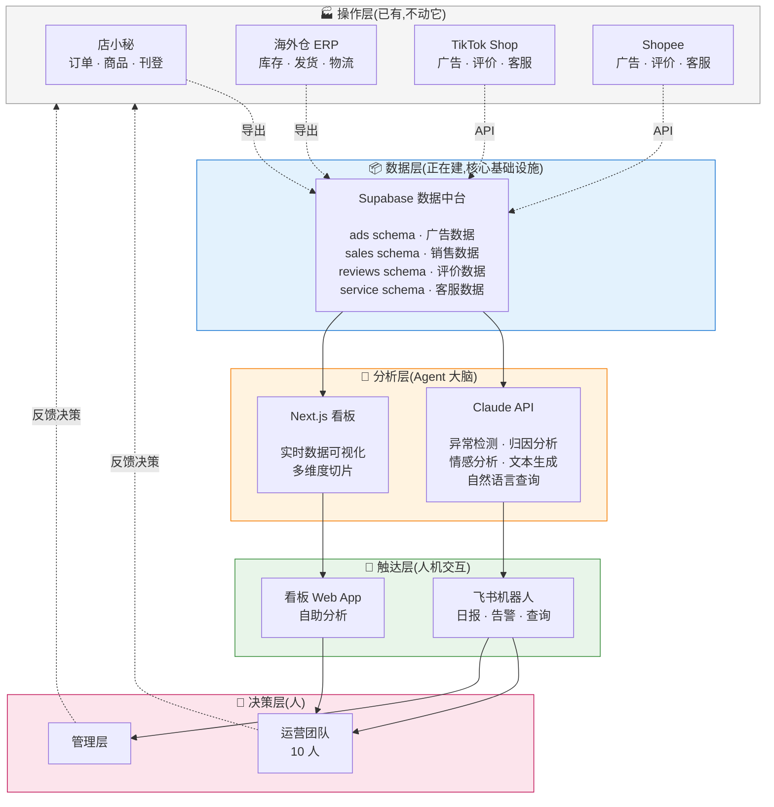
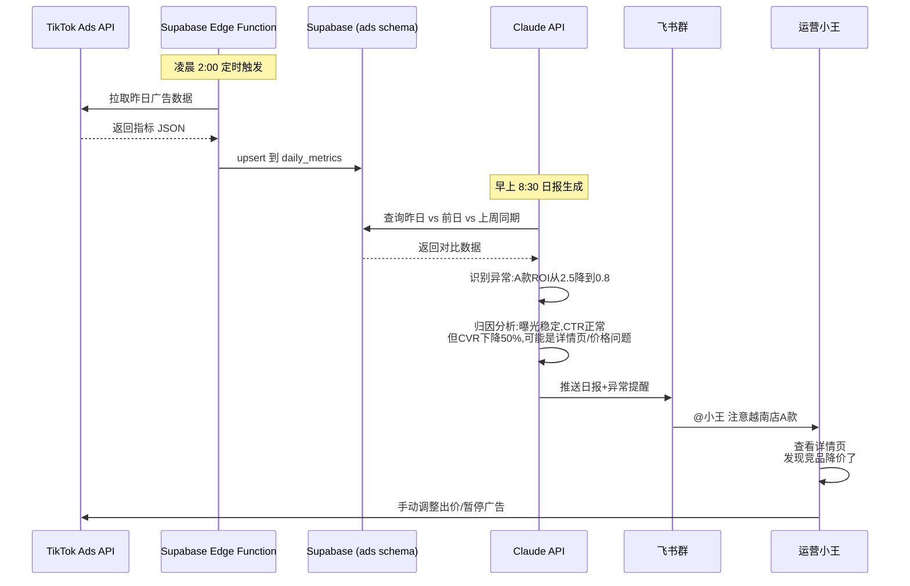
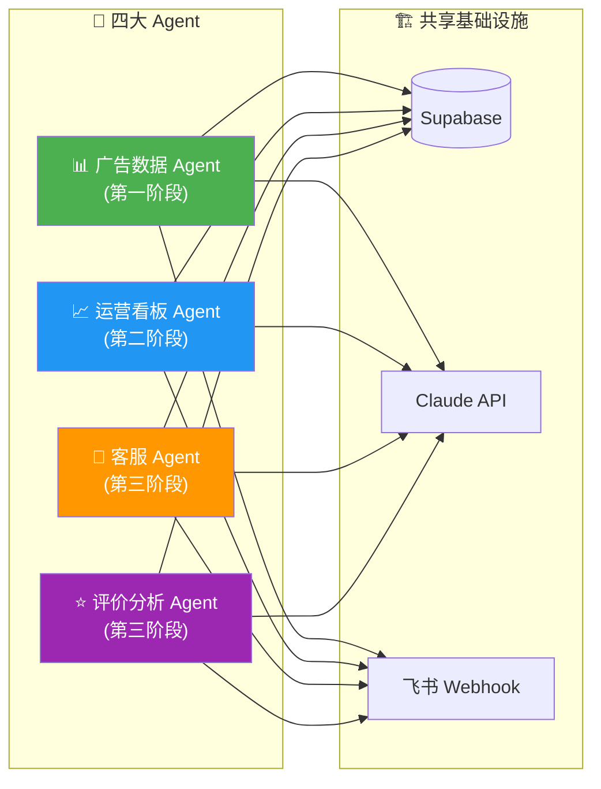
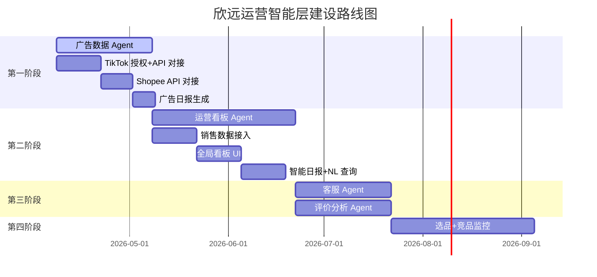

# 欣远电商「运营智能层」整体架构

> 版本:v1.0
> 日期:2026-04-08
> 项目代号:xinyuan-ops-ai

---

## 一、核心定位

**不是又一个 ERP,而是叠加在现有 ERP 之上的"运营大脑"。**

现状是:店小秘负责订单和商品中台,海外仓 ERP 负责库存和发货,操作层的事情已经被解决得不错。但运营每天还是花大量时间在**数据统计、异常判断、写报告、回复客户、分析评价**这些事情上 —— 这些都是"思考和决策"相关的工作,也是运营最贵的时间。

运营智能层要做的就是:**把这部分工作交给 Agent,让人专注在真正需要人判断的事情上**。

## 二、分层架构

### 各层职责

| 层级 | 职责 | 已有 / 待建 | 技术栈 |
|---|---|---|---|
| **操作层** | 执行交易、库存、刊登 | ✅ 已有 | 店小秘 + 海外仓 ERP + 各平台 |
| **数据层** | 统一存储所有运营数据 | 🔨 建设中 | Supabase(PostgreSQL) |
| **分析层** | 智能分析 + 可视化 | 🔨 建设中 | Claude API + Next.js |
| **触达层** | 主动推送 + 被动查询 | 🔨 建设中 | 飞书机器人 + Web 看板 |
| **决策层** | 人做最终决策 | ✅ 人 | 运营 + 管理层 |

## 三、数据流向:一个完整的例子

以"越南 TikTok 某款凉鞋 ROI 突然下降"这个场景为例,看数据怎么流:

这个流程里,**Agent 做了 90% 的重活**(拉数据、对比、归因、写报告),**人只做 10% 最关键的决策**(查看实际情况、做出业务判断)。

## 四、模块全景

运营智能层包含 4 个核心 Agent,共享同一套基础设施:

### 各 Agent 核心职责

**📊 广告数据 Agent(第一阶段 · 正在做)**
- 每天从 TikTok Shop / Shopee API 拉取广告数据
- 多币种统一换算成人民币
- 异常检测 + 归因分析
- 自动生成广告日报推送飞书

**📈 运营看板 Agent(第二阶段 · 下一步)**
- 整合广告数据 + 店小秘订单数据 + 海外仓库存数据
- 全局运营看板(销售 / 广告 / 库存 / 利润多维度)
- 智能运营日报(不只列数字,还给洞察和建议)
- 支持自然语言查询("上周泰国店利润率最高的 5 款是哪些?")

**💬 客服 Agent(第三阶段)**
- 自动回复高频问题(物流查询、尺码、材质)
- 差评 5 分钟告警 + 回复草稿生成
- 退款请求智能分流
- 夜间和节假日兜底

**⭐ 评价分析 Agent(第三阶段,和客服 Agent 并行)**
- 聚合所有平台评价
- 情感分析 + 问题分类(尺码 / 色差 / 物流 / 做工)
- 按 SKU 汇总痛点,反哺产品选品
- 差评回复建议

## 五、三阶段路线图

### 时间估算

| 阶段 | 时长 | 关键产出 | 人力投入 |
|---|---|---|---|
| 第一阶段 | ~1 个月 | 广告 Agent 跑通,每天自动出报告 | 你 + AI 辅助 |
| 第二阶段 | ~1.5 个月 | 全局运营看板 + 智能日报 | 你 + AI 辅助 |
| 第三阶段 | ~1 个月 | 客服 + 评价 Agent | 你 + AI 辅助 |
| 第四阶段 | ~1.5 个月 | 选品和竞品监控(可选) | 你 + AI 辅助 |

总计约 5 个月可以建成完整的运营智能层。

## 六、价值估算

按你们现状保守估算:

| 维度 | 当前(人工) | 建成后 | 节省 |
|---|---|---|---|
| 每日数据统计 | 10 人 × 1 小时 | 10 人 × 10 分钟 | **8 小时/天** |
| 每日日报撰写 | 2 人 × 1 小时 | 自动生成 | **2 小时/天** |
| 客服高频问题回复 | 2 人 × 3 小时 | 2 人 × 1 小时 | **4 小时/天** |
| 评价分析 | 几乎不做 | 自动分析 | **质量提升** |
| 异常发现时效 | 发现时往往晚了半天 | 实时告警 | **决策前置** |

**每天节省约 14 小时**,相当于释放 1.7 个人的工作量,这些人可以做更有价值的事(选品、策略、新市场开拓)。

更重要的是**决策质量的提升**:运营从"救火"变成"主动出击",管理层能看到全局数据做判断,而不是听运营口头汇报。

## 七、关键设计原则

1. **不重复造轮子**:店小秘和海外仓 ERP 能做的事,Agent 不碰。Agent 只做它们不覆盖的分析和决策辅助
2. **数据单向流动**:Agent 原则上**只读**,所有需要写回平台的操作(比如调整广告、下架商品)都需要人工确认。避免 Bug 造成灾难
3. **Claude 只做信息处理**:Agent 的核心是"把数据变成洞察",不做决策。决策权永远在人手里
4. **分阶段可交付**:每个阶段结束都有可用的产出,不是"等半年才能看到东西"。广告 Agent 做完就能用,不依赖后续阶段
5. **基础设施复用**:Supabase + Claude API + 飞书机器人这三个基础设施一次搭好,所有 Agent 共用,后续边际成本极低

## 八、风险与应对

| 风险 | 影响 | 应对 |
|---|---|---|
| TikTok/Shopee API 审核慢或被拒 | 第一阶段延期 | 准备店小秘导出作为备用数据源 |
| 数据量增长超预期 | Supabase 性能瓶颈 | daily_metrics 表做月度分区,超过 1000 万行再考虑 |
| Claude API 成本超预期 | 运营成本 | 日报用 Claude Sonnet,临时查询用更便宜的模型;缓存常见问题 |
| 运营团队不会用 | 项目失败 | 每个阶段上线后做 30 分钟培训,做得像飞书那样傻瓜 |
| 平台 API 政策变更 | 数据中断 | 多渠道数据源(API + 店小秘导出 + RPA 兜底) |

---

## 下一步行动

1. **当前**:继续推进广告 Agent 第一阶段(TikTok 授权流程)
2. **本周**:确认这份架构文档的方向,作为后续所有工作的指导
3. **下周**:开始第二阶段(运营看板 Agent)的详细设计
4. **2 周后**:TikTok 审核通过,开始真实数据对接
