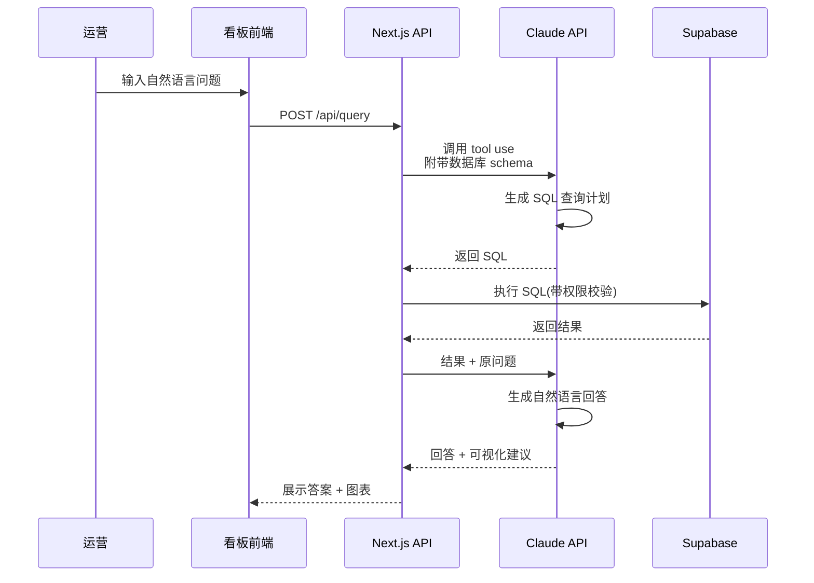

# 第二阶段:运营看板 Agent 详细规划

> 前置阶段:广告数据 Agent(第一阶段)
> 预计时长:约 1.5 个月
> 定位:基于已有数据层,叠加"全局视角 + 智能解读"能力

---

## 一、问题定义

### 现在运营是怎么看数据的?

按我的理解,你们运营团队现在的日常数据工作流大概是这样:

1. **早上上班**:登录店小秘看昨天的订单和销售数据
2. **中午**:登录各平台后台看广告数据、评价、客诉
3. **傍晚**:在飞书表格里手工填日报,汇总给主管
4. **主管**:把 10 个运营的日报手工合并,再汇报给老板

这里有 4 个核心问题:

**问题 1:数据散落在 N 个地方**
- 销售在店小秘
- 广告在各平台(6 个店铺 × 2 平台 = 12 处)
- 库存在海外仓 ERP
- 评价在各平台
- 人工数据在飞书表格

想看"某款鞋的完整画像"(销量 + 广告 + 库存 + 评价 + 利润),至少要切换 5 个系统。

**问题 2:数据呈现 ≠ 数据理解**
店小秘有看板,但它只能告诉你"昨天卖了 200 单",不能告诉你"为什么昨天比前天少 80 单、主要是哪几个 SKU 掉的、可能的原因是什么"。

**问题 3:日报靠人写**
10 个运营每天花 30-60 分钟写日报,内容还都是重复的数据搬运,真正的分析和洞察反而没时间做。

**问题 4:决策滞后**
等主管汇总完日报往往已经下班,异常发现都是第二天甚至第三天的事。

### 运营看板 Agent 要解决的

用一句话概括:**让运营打开一个页面就能看到所有数据,让 Claude 每天早上把昨天发生的事情和原因写清楚推到飞书**。

## 二、核心功能模块

### 模块 1:统一数据看板

**首页布局(参考设计)**

```
┌─────────────────────────────────────────────────────────┐
│  欣远运营看板                        [日期选择器] [店铺筛选] │
├─────────────────────────────────────────────────────────┤
│                                                         │
│  ┌─ 今日核心指标 ─────────────────────────────────────┐ │
│  │ 销售额 ¥125k  订单 320  ROI 2.8  利润率 18%        │ │
│  │ ↑12%         ↑8%      ↓0.3    ↑2%                 │ │
│  └────────────────────────────────────────────────────┘ │
│                                                         │
│  ┌─ 店铺矩阵(6 市场 × 2 平台)─────────────────────┐ │
│  │         TikTok Shop          Shopee                │ │
│  │  越南   ¥28k  ROI 3.1    ¥15k  ROI 2.5 ⚠          │ │
│  │  泰国   ¥22k  ROI 2.8    ¥12k  ROI 2.9            │ │
│  │  菲律宾 ¥18k  ROI 2.6    ¥10k  ROI 2.4            │ │
│  │  ...                                                │ │
│  └────────────────────────────────────────────────────┘ │
│                                                         │
│  ┌─ 今日 TOP SKU ──────────────────────────────────┐ │
│  │ 1. WS-HH-PS-03-25001  销量 45  ROI 4.2  利润¥2.8k │ │
│  │ 2. WS-HH-PS-03-25002  销量 38  ROI 3.8  利润¥2.3k │ │
│  │ ...                                                  │ │
│  └────────────────────────────────────────────────────┘ │
│                                                         │
│  ┌─ 🤖 Claude 今日洞察 ───────────────────────────┐ │
│  │ 1. 越南 Shopee 店 ROI 从 3.0 降到 2.5,主因是...  │ │
│  │ 2. 凉鞋品类整体销量上升 15%,泰国涨势最猛        │ │
│  │ 3. 3 款商品库存预警,建议补货                    │ │
│  └────────────────────────────────────────────────────┘ │
└─────────────────────────────────────────────────────────┘
```

**关键设计决策:**
- **首页只放一屏能看完的内容**:运营每天要快速扫一眼,不需要无穷滚动
- **用颜色和箭头表达趋势**:红色 = 下降,绿色 = 上升,黄色 = 异常
- **Claude 洞察放在首页底部**:不是埋在二级页面,要让人第一眼就能看到"今天最重要的事情是什么"

### 模块 2:多维度切片分析

除了首页总览,需要支持按以下维度深入:

- **按店铺**:选某个店铺看它的完整数据(销售 + 广告 + 库存 + 评价)
- **按市场**:6 个国家横向对比
- **按品类**:凉鞋 / 高跟鞋 / 靴子等
- **按 SKU**:单个 SKU 的全生命周期数据
- **按时间**:日 / 周 / 月 / 自定义区间
- **按运营**:每个运营负责的店铺/商品的数据(用 operator_code 关联)

每个切片下都支持下钻到更细粒度,也支持横向对比("越南 vs 泰国"、"这周 vs 上周")。

### 模块 3:智能日报生成

这是 Agent 真正的"智能"所在。每天早上 8:30 自动推送到飞书群,格式大概是:

```markdown
# 📊 欣远运营日报 · 2026-04-08

## 🎯 核心数据
昨日销售额 ¥125,340(↑12% vs 前日,↑8% vs 上周同期)
订单数 320(↑8%)· ROI 2.8(↓0.3)· 利润率 18%

## ✨ 今日亮点
1. **泰国 TikTok 店创单日新高**:销售额 ¥35k,主要由爆款
   WS-HH-PS-03-25001 贡献(单日 45 单,ROI 4.2)
2. **凉鞋品类整体起量**:6 国凉鞋销售环比上升 15%,
   季节性趋势开始显现

## ⚠️ 需要关注
1. **越南 Shopee 店 ROI 异常下降**(3.0 → 2.5)
   - 曝光、点击正常,CVR 从 2.1% 降到 1.5%
   - 对比竞品:TA 类目 TOP 3 最近平均降价 8%
   - 🔍 建议:检查详情页/评价,或考虑跟进调价
   - 👤 @小王 请关注

2. **3 款 SKU 库存预警**
   - WS-HH-PS-03-25003 · 当前库存 12 · 建议补货 150
   - WS-HH-PS-03-25007 · 当前库存 8  · 建议补货 200
   - WS-HH-PS-03-25012 · 当前库存 15 · 建议补货 120
   - 👤 @采购 请安排

3. **差评集中出现**:WS-HH-PS-03-25005 昨日新增 5 条差评,
   主要问题是"尺码偏小"(4/5)
   - 👤 @产品 建议调整尺码表

## 📈 对比上周
[表格:各店铺本周 vs 上周的销售、广告、ROI 对比]
```

这不是模板套数据,而是 Claude **读完数据后真正理解情况,生成有洞察的文字**。每天的内容都不一样,只有真正重要的事情才会被提出来。

### 模块 4:自然语言查询

在看板首页放一个搜索框,运营可以直接问问题:

- "上周泰国店利润率最高的 5 款是哪些?"
- "哪些 SKU 这个月广告花了钱但没出单?"
- "越南店 3 月份的日均 ROI 趋势"
- "所有凉鞋里评价最差的 10 款"

实现原理:



**安全设计**:
- Claude 生成的 SQL 在执行前要经过白名单校验(只允许 SELECT,只能查 ads schema 和指定的几个视图)
- 查询结果按用户权限过滤(RLS)
- 所有查询记录到日志,便于审计

## 三、数据源接入

第二阶段要把这些数据都汇聚到 Supabase:

### 新增 schema

在第一阶段 `ads` schema 的基础上,第二阶段新增:

```sql
-- 销售数据(来自店小秘)
CREATE SCHEMA sales;

-- 库存数据(来自海外仓 ERP)
CREATE SCHEMA inventory;

-- 评价数据(来自各平台 API)
CREATE SCHEMA reviews;
```

### 数据接入方式

| 数据 | 来源 | 频率 | 方式 |
|---|---|---|---|
| 广告 | TikTok/Shopee API | 每小时 | Supabase Edge Function(第一阶段已有) |
| 订单/销售 | 店小秘导出 | 每天 | 手动上传 → n8n 自动化 → Supabase |
| 库存 | 海外仓 ERP 导出 | 每天 | 同上 |
| 评价 | TikTok/Shopee API | 每 6 小时 | Supabase Edge Function |
| 汇率 | 中行 API | 每天 | Supabase Edge Function |

**关于店小秘和海外仓 ERP 的接入**:

这两个系统如果没有开放 API,可以用以下顺序尝试:
1. **最佳**:它们如果有 API,直接对接(需要问供应商)
2. **次选**:配置成每天定时导出 CSV/Excel 到指定位置(邮箱、FTP、飞书文件夹),写个 Supabase Edge Function 定时读取并导入
3. **兜底**:运营每天手动上传一次导出文件,看板提供上传页面

建议先用方式 2 或 3,等基础跑通了再研究深度对接。

### 数据清洗和标准化

各系统字段命名不一致,需要在导入层做统一:

```typescript
// 示例:店小秘订单数据 → 标准化
const standardizedOrder = {
  order_id: raw['订单编号'],
  platform: mapPlatform(raw['平台']),
  market: mapMarket(raw['国家']),
  sku_code: raw['SKU'],
  quantity: parseInt(raw['数量']),
  gmv_local: parseFloat(raw['销售金额']),
  currency: raw['币种'],
  gmv_cny: parseFloat(raw['销售金额']) * getExchangeRate(raw['币种']),
  operator_code: raw['操作人'] ?? null,  // 对应 SKU 命名系统里的运营代码
  order_date: parseDate(raw['下单时间']),
};
```

## 四、技术实现要点

### 前端:Next.js 看板

关键页面:
- `/` 首页总览
- `/shops` 店铺矩阵
- `/shops/[id]` 单店铺详情
- `/products` 商品分析
- `/products/[sku]` 单 SKU 分析
- `/query` 自然语言查询
- `/reports` 历史报告归档

组件库用 **shadcn/ui + Recharts**(你之前项目用过的),保持一致性。

### 后端:Supabase Edge Functions

- `daily-report-generator`:每天 8:30 触发,生成日报推送飞书
- `anomaly-detector`:每小时扫描一次数据,发现异常立即推送
- `nl-query-handler`:处理自然语言查询请求

### 智能层:Claude API 调用策略

**日报生成**(一天一次):
- 使用 Claude Sonnet 4.6(需要复杂推理)
- 输入:昨日 + 前日 + 上周同期 的核心数据(大约 5-10KB JSON)
- 输出:Markdown 格式的日报
- 成本估算:单次约 $0.05,一个月 $1.5

**自然语言查询**(按需):
- 使用 Claude Sonnet 4.6
- 分两步:先生成 SQL,再解读结果
- 成本估算:单次约 $0.02,假设一天 100 次查询,一个月 $60

**异常检测归因**(按需):
- 使用 Claude Sonnet 4.6
- 触发条件:某个指标偏离正常范围 > 20%
- 成本估算:单次约 $0.03,假设一天 10 次,一个月 $9

**月度总成本估算**:约 $70-100(~500-700 元人民币),相对于节省的人力完全可以忽略。

## 五、开发里程碑

| 里程碑 | 产出 | 预计时间 |
|---|---|---|
| M1 | 销售数据接入 + 订单表设计 | 第 1 周 |
| M2 | 看板首页 + 店铺矩阵页 | 第 2-3 周 |
| M3 | SKU 详情页 + 多维度切片 | 第 4 周 |
| M4 | 日报生成器 + 飞书推送 | 第 5 周 |
| M5 | 自然语言查询 | 第 6 周 |
| M6 | 评价数据接入 + 库存数据接入 | 第 7 周 |
| M7 | 测试、优化、运营培训 | 第 8 周 |

## 六、和第一阶段的衔接

第一阶段的广告数据 Agent 不会废弃,它的所有产出都是第二阶段的基础:

| 第一阶段产出 | 在第二阶段的作用 |
|---|---|
| `ads` schema | 直接复用,是看板的数据源之一 |
| TikTok/Shopee API 对接 | 直接复用,多加一些接口调用(订单、评价) |
| Supabase Edge Function 框架 | 直接复用,加新的同步任务 |
| Claude API 集成 | 从"只做广告异常检测"升级到"全局分析" |
| 飞书推送 | 从"只发广告日报"升级到"发综合日报" |

**换句话说,你现在在搭建的不是"一个广告工具",而是一个可复用的基础设施**。每多做一个 Agent,前面的投入就多一份回报。

## 七、验收标准

第二阶段做完后,你应该能回答这个问题:"**今天我的运营团队打开电脑第一件事做什么?**"

理想答案:
1. 10 秒内:扫一眼飞书里的运营日报,知道昨天发生了什么
2. 30 秒内:打开看板首页,确认没有被标红的异常
3. 1 分钟内:对着自己负责的店铺,用自然语言问 2-3 个问题,快速定位今天的重点
4. 然后:直接开始处理真正的决策工作,不用再花 30 分钟填表格
