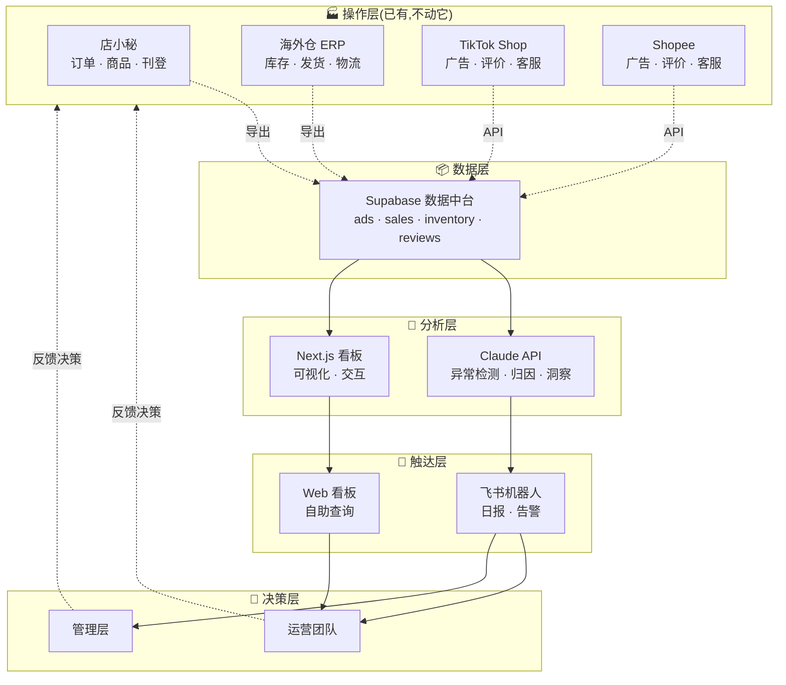

# 欣远电商运营智能 Agent 完整规划说明书

> **文档版本**:v1.0
> **创建日期**:2026-04-08
> **文档定位**:Claude Code 执行手册 —— 这份文档是整个项目的唯一事实来源(Single Source of Truth),Claude Code 应该把它作为所有决策的依据
> **使用方式**:Claude Code 会话中,用户会要求你按章节执行。你应该先完整读一遍,然后按 §9 的任务清单顺序推进

---

## 目录

1. [项目背景](#1-项目背景)
2. [问题定义](#2-问题定义)
3. [产品定位](#3-产品定位)
4. [架构设计](#4-架构设计)
5. [技术栈](#5-技术栈)
6. [数据模型](#6-数据模型)
7. [Agent 能力清单](#7-agent-能力清单)
8. [开发路线图](#8-开发路线图)
9. [任务清单(Claude Code 执行指南)](#9-任务清单claude-code-执行指南)
10. [编码规范](#10-编码规范)
11. [关键设计决策](#11-关键设计决策)
12. [避坑指南](#12-避坑指南)
13. [附录](#13-附录)

---

## 1. 项目背景

### 1.1 公司概况

**欣远电商**是一家跨境电商公司,主营女鞋,覆盖 TikTok Shop 和 Shopee 两个平台、东南亚六国市场(泰国、越南、菲律宾、马来西亚、印度尼西亚、新加坡)。

- **团队规模**:约 10 人
- **组织架构**:运营部、产品/采购部、视觉/创意部
- **业务特点**:女鞋品类 SKU 众多(颜色 × 尺码组合爆炸),跨 6 国市场运营,依赖广告投放驱动销量

### 1.2 现有系统

公司现有的技术/工具基础:

| 系统 | 功能 | 状态 |
|---|---|---|
| 店小秘 | 订单和商品中台、多平台刊登、基础数据导出 | ✅ 已使用 |
| 海外仓 ERP | 库存、入库、出库、发货、物流 | ✅ 已使用 |
| 飞书 | 内部协作、文档、消息通知 | ✅ 已使用 |
| Supabase | 数据库(商品管理系统使用中) | ✅ 已使用 |
| Netlify | 前端部署平台 | ✅ 已使用 |
| 店小秘广告数据 | 几乎没有,仅基础聚合 | ❌ 空白 |

### 1.3 用户画像

**项目所有者**:Jesee
- 角色:公司管理/系统负责人
- 技术背景:熟悉前端和全栈开发,正在深入学习 Claude Code 工作流
- 工作风格:迭代式、实用主义、偏好具体可交付的成果
- 设备:MacBook Air(username: `guojiangwei`)
- 沟通语言:中文

---

## 2. 问题定义

### 2.1 运营当前的痛点

店小秘和海外仓 ERP 解决了**操作层**的问题(订单下去、商品上架、货物发出),但运营团队每天仍然花费大量时间在以下事情上:

**痛点 1:数据分散,统计耗时**
- 广告数据散落在 12 个后台(6 国 × 2 平台)
- 评价、客服消息分散在各平台
- 每个运营每天花 1-1.5 小时手工统计广告数据
- 想看"某款鞋的完整画像"需要切换至少 5 个系统

**痛点 2:数据呈现 ≠ 数据理解**
- 店小秘能告诉你"昨天卖了 200 单",不能告诉你"为什么比前天少 80 单、哪些 SKU 掉了、可能原因是什么"
- 异常发现往往是事后才意识到

**痛点 3:日报靠人写**
- 10 个运营每天花 30-60 分钟填日报
- 内容多是重复的数据搬运,真正的分析反而没时间做
- 主管再花时间合并 10 份日报,信息经过两次"压缩"后失真

**痛点 4:客服响应滞后**
- 东南亚时区和国内时差,运营下班后客户咨询无人响应
- 高频问题(物流查询、尺码咨询)重复回复浪费时间
- 差评发现不及时,错过最佳挽回窗口

**痛点 5:评价数据被浪费**
- 每天产生大量评价,但没人系统地看
- 评价里藏着产品改进的关键信息(尺码偏大/偏小、色差、物流、做工),没人提炼

### 2.2 量化损失

按 10 人团队保守估算,每天消耗的时间:

| 工作项 | 消耗 |
|---|---|
| 广告数据统计 | 10 人 × 1 小时 = 10 小时 |
| 日报撰写 | 10 人 × 0.5 小时 = 5 小时 |
| 客服高频问题 | 2 人 × 3 小时 = 6 小时 |
| 异常数据排查 | 分散但频繁 |
| 评价查看 | 几乎不做(但应该做) |

**每天约 21 小时的可自动化工时**,相当于 2.5 个全职员工的工作量。

---

## 3. 产品定位

### 3.1 核心定位

**不是又一个 ERP,而是叠加在现有 ERP 之上的"运营大脑"。**

这个 Agent 系统要做的:
- ✅ 处理分析、统计、归因、建议类的"脑力工作"
- ✅ 补齐店小秘和海外仓 ERP 不覆盖的数据空白(广告、评价、智能日报)
- ✅ 让运营从"救火"变成"主动出击"

这个 Agent 系统**不做**:
- ❌ 订单处理、商品刊登、库存管理(店小秘和海外仓 ERP 已做)
- ❌ 自动执行写操作(调整广告、下架商品)—— 决策权永远在人手里
- ❌ 替代运营团队 —— 是提升每个人的产出,不是裁员

### 3.2 核心价值主张

"**让运营打开电脑做的第一件事,不再是统计数据,而是决策和创造。**"

### 3.3 成功标准

项目成功的衡量标准:

1. **效率标准**:每天可自动化的 21 小时工作中,至少节省 14 小时(≈ 70%)
2. **时效标准**:数据异常从"事后发现"变为"实时告警"(< 1 小时发现)
3. **质量标准**:运营日报从"数据搬运"变为"有洞察的分析"
4. **采纳标准**:运营团队主动使用看板,而不是被强制要求

---

## 4. 架构设计

### 4.1 五层架构



### 4.2 各层职责

| 层级 | 职责 | 已有 / 待建 |
|---|---|---|
| **操作层** | 执行交易、库存、刊登 | ✅ 店小秘 + 海外仓 ERP + 平台后台 |
| **数据层** | 统一存储所有运营数据 | 🔨 建设中(Supabase) |
| **分析层** | 智能分析 + 可视化 | 🔨 待建 |
| **触达层** | 主动推送 + 被动查询 | 🔨 待建 |
| **决策层** | 人做最终决策 | ✅ 人 |

### 4.3 核心原则

1. **不重复造轮子**:店小秘和海外仓 ERP 能做的事,Agent 不碰
2. **数据只读,Agent 不做写操作**:所有需要写回平台的操作必须人工确认
3. **Claude 只做信息处理**:Agent 核心是"把数据变成洞察",不做决策
4. **分阶段可交付**:每个阶段结束都有可用产出
5. **基础设施复用**:所有 Agent 共用 Supabase + Claude API + 飞书机器人

---

## 5. 技术栈

### 5.1 技术选型总览

| 层级 | 技术 | 理由 |
|---|---|---|
| **前端框架** | Next.js 15(App Router) | 用户熟悉,SSR 友好,生态完善 |
| **语言** | TypeScript(strict 模式) | 类型安全,减少运行时错误 |
| **UI 样式** | Tailwind CSS + shadcn/ui | 用户熟悉的技术栈,保持一致性 |
| **图表库** | Recharts | 和 React 生态契合,够用 |
| **数据库** | Supabase (PostgreSQL) | 复用用户现有项目 |
| **ORM** | Supabase JS Client | 官方客户端,省事 |
| **定时任务** | Supabase Edge Functions | 和数据库同生态,低延迟 |
| **重型 ETL** | GitHub Actions | 免费额度,Python 环境完整 |
| **Agent 智能** | Claude API (claude-sonnet-4-6) | 能力强,成本可控 |
| **部署** | Netlify | 用户现有部署平台 |
| **通知** | 飞书机器人 Webhook | 用户公司内部协作工具 |

### 5.2 版本要求

```json
{
  "node": ">=20.0.0",
  "next": "^15.0.0",
  "react": "^19.0.0",
  "typescript": "^5.3.0",
  "@supabase/supabase-js": "^2.39.0",
  "@supabase/ssr": "^0.5.0",
  "@anthropic-ai/sdk": "^0.30.0",
  "tailwindcss": "^3.4.0",
  "recharts": "^2.12.0",
  "date-fns": "^3.0.0"
}
```

### 5.3 为什么选这些而不是其他

**为什么不用 Vercel?** 用户的其他项目都在 Netlify,保持一致减少切换成本。

**为什么不用 Python + FastAPI 做后端?** Next.js API Routes 足够覆盖当前需求,全栈 TypeScript 减少上下文切换。重型 ETL 任务再用 GitHub Actions + Python。

**为什么用 Supabase 而不是自建 PostgreSQL?** 开箱即用的认证、RLS、Edge Functions,省去运维成本。

**为什么用 Claude 而不是 GPT?** 用户是 Anthropic 产品的深度用户,且 Claude 在长文本分析和代码生成上表现更好。

---

## 6. 数据模型

### 6.1 Schema 组织

使用独立 schema 隔离不同数据域,通过 `sku_code` 等共同字段做关联:

```
public   - 现有商品管理系统(Jesee 已有项目)
ads      - 广告数据(第一阶段)
sales    - 销售和订单数据(第二阶段)
inventory - 库存数据(第二阶段)
reviews  - 评价数据(第三阶段)
service  - 客服对话数据(第三阶段)
```

### 6.2 第一阶段:ads schema(8 张表)

完整的 SQL 定义见 `supabase/migrations/001_ads_schema.sql`,这里只列核心表:

**ads.accounts** — 广告账户
- 一个账户 = 某平台的某店铺的广告账户
- 存储 OAuth token、币种、时区、运营代码

**ads.campaigns / ad_groups / ads** — 广告三层结构
- 遵循 TikTok 和 Shopee 通用的 Campaign → AdGroup → Ad 三层结构
- `ads.ads` 表通过 `sku_code` 关联到商品

**ads.daily_metrics** — 核心指标表(最高频访问)
- 每个广告每天一行
- **双币种存储**:`spend_local` + `spend_cny` + `exchange_rate`
- 预存衍生指标:ROI、CTR、CPC、CPM、CVR、CPA

**ads.exchange_rates** — 汇率表
- 每天一次,记录各币种对人民币的汇率
- 所有本币金额换算都必须基于这张表

**ads.sync_logs** — 同步任务日志
- 记录每次数据拉取的状态,便于排查问题

### 6.3 未来 schema 预告

**sales schema(第二阶段)**
- `sales.orders` - 订单
- `sales.order_items` - 订单商品明细
- `sales.daily_sales` - 日度销售汇总

**reviews schema(第三阶段)**
- `reviews.reviews` - 原始评价
- `reviews.review_analysis` - Claude 分析结果(情感、问题分类)
- `reviews.sku_insights` - 按 SKU 汇总的痛点

### 6.4 数据流

```
[平台 API / 店小秘导出 / 海外仓导出]
        ↓
[Supabase Edge Function 或 GitHub Action]
        ↓
[数据清洗 + 标准化 + 币种换算]
        ↓
[Supabase 各 schema]
        ↓
[Next.js API Route 或 前端直连]
        ↓
[看板展示 / Claude 分析 / 飞书推送]
```

---

## 7. Agent 能力清单

### 7.1 四大 Agent

| Agent | 阶段 | 核心能力 |
|---|---|---|
| **📊 广告数据 Agent** | 第一阶段 | 多平台广告数据采集、统一、分析、日报 |
| **📈 运营看板 Agent** | 第二阶段 | 销售+广告+库存全局看板、智能日报、NL 查询 |
| **💬 客服 Agent** | 第三阶段 | 自动回复高频问题、差评告警、退款分流 |
| **⭐ 评价分析 Agent** | 第三阶段 | 情感分析、问题分类、SKU 痛点挖掘 |

### 7.2 广告数据 Agent 详细能力

**数据采集**
- [ ] TikTok Shop Marketing API 对接
- [ ] Shopee Open Platform API 对接
- [ ] OAuth 授权流程(authorize → callback → token 存储 → 定时刷新)
- [ ] 每小时增量同步广告数据
- [ ] 失败重试和错误日志

**数据处理**
- [ ] 每日汇率拉取(中国银行或 exchangerate-api)
- [ ] 多币种换算为人民币
- [ ] 衍生指标计算(ROI、CTR、CPC、CPM、CVR、CPA)
- [ ] 数据质量校验(去重、空值处理)

**智能分析**
- [ ] 每日异常检测(ROI、CTR、CPC 偏离正常范围)
- [ ] 异常归因(曝光变化?CTR 变化?转化率变化?)
- [ ] 对比分析(昨天 vs 前天 vs 上周同期)
- [ ] 每日运营日报自动生成

**可视化和触达**
- [ ] 首页看板:6 店铺矩阵、核心指标卡片、趋势图
- [ ] 店铺详情页:广告活动列表、日度趋势
- [ ] 飞书日报推送(每天 8:30)
- [ ] 异常实时告警(> 20% 偏离立即推送)

### 7.3 运营看板 Agent 详细能力

**数据接入**
- [ ] 店小秘订单数据导入(CSV 上传或定时读取)
- [ ] 海外仓 ERP 库存数据导入
- [ ] 数据清洗和标准化

**全局看板**
- [ ] 首页核心指标(销售额、订单、ROI、利润率、退货率)
- [ ] 店铺矩阵视图(6 国 × 2 平台)
- [ ] SKU 全生命周期视图
- [ ] 按运营人员(operator_code)切片

**智能日报**
- [ ] Claude 基于真实数据生成日报(不是模板套数据)
- [ ] 自动识别亮点和问题
- [ ] 生成可执行的建议(@具体运营)
- [ ] 推送飞书群

**自然语言查询**
- [ ] Claude tool use 生成 SQL
- [ ] SQL 白名单校验(只允许 SELECT)
- [ ] 结果解读 + 可视化建议

### 7.4 客服和评价 Agent 详细能力

(第三阶段规划,暂不展开详细任务)

核心功能:
- 客服自动回复高频问题(物流、尺码、材质)
- 差评 5 分钟告警 + Claude 生成回复草稿
- 退款请求智能分流
- 评价情感分析和问题分类
- 按 SKU 痛点汇总,反哺产品选品

---

## 8. 开发路线图

### 8.1 总体时间线

```
第 1 周: 项目骨架 + 首页空壳           → 网站能访问
第 2 周: 假数据 + 看板雏形             → 看板能看
第 3 周: 汇率 API + Claude 日报        → Agent 能说话
第 4 周: TikTok 真实授权 + 数据同步    → 真数据流动
第 5-6 周: Shopee 接入 + 优化           → 双平台覆盖
第 7-10 周: 运营看板 Agent(第二阶段)  → 全局视图
第 11-14 周: 客服 Agent + 评价 Agent    → 智能闭环
```

### 8.2 第一阶段里程碑(4 周)

| 里程碑 | 交付物 | 验收标准 |
|---|---|---|
| **M1 · Week 1** | 项目骨架 + 部署 | 访问 `xinyuan-ads.netlify.app` 看到首页 |
| **M2 · Week 2** | 假数据看板 | 看板展示 6 店铺矩阵,交互流畅 |
| **M3 · Week 3** | Claude 日报 | 每天 8:30 飞书收到日报(基于假数据) |
| **M4 · Week 4** | 真实数据接入 | TikTok 越南店真实数据流入并展示 |

### 8.3 为什么这个顺序

**核心思路:先让链路跑通,再填真数据。**

传统做法是"等 TikTok 审核 → 写代码 → 看效果",前 2 周什么都看不到,容易失去动力。这个方案是"用假数据把看得见的东西做出来,审核通过了再把真数据填进去",每周都有可以展示的成果。

**好处:**
1. TikTok 审核不阻塞开发
2. 基础设施和业务逻辑解耦
3. 心理节奏感强,每周都有成就感
4. UI 和交互可以提前给团队看,收集反馈

---

## 9. 任务清单(Claude Code 执行指南)

这一节是 Claude Code 的**实际操作手册**。每个任务都明确到可执行粒度,你(Claude Code)应该按顺序推进,完成一个勾一个。

### 9.1 Phase 0:前置条件检查

在开始任何编码之前,确认以下事项:

- [ ] 用户已在 TikTok Partner Center 提交应用审核(不阻塞后续)
- [ ] 用户已在 Supabase 执行 `001_ads_schema.sql` 创建 `ads` schema
- [ ] 用户已在 Supabase Project Settings → API → Exposed schemas 添加 `ads`
- [ ] 用户本地已安装 Node.js 20+
- [ ] 用户已登录 Netlify CLI(如果走 CLI 部署)

**Claude Code 动作**:开始任何新会话时,先问用户以上条件是否满足。不满足的帮助用户先完成。

### 9.2 Phase 1:项目骨架(Week 1)

**任务 1.1:初始化 Next.js 项目**

```bash
# 到用户工作目录
cd ~/code

# 注意:如果 xinyuan-ads 文件夹已存在(含 docs/ 和 src/),先备份现有文件
# 然后在临时目录初始化,再合并

mkdir xinyuan-ads-init && cd xinyuan-ads-init
npx create-next-app@latest . \
  --typescript --tailwind --eslint \
  --app --src-dir --turbopack \
  --import-alias "@/*" \
  --no-git

# 合并到现有项目目录
# (Claude Code 应该智能处理文件合并,保留已有的 src/ 文件)
```

验收:`npm run dev` 能启动开发服务器,访问 `localhost:3000` 看到 Next.js 默认页。

**任务 1.2:安装项目依赖**

```bash
npm install @supabase/supabase-js @supabase/ssr
npm install @anthropic-ai/sdk
npm install date-fns
npm install recharts
```

**任务 1.3:初始化 shadcn/ui**

```bash
npx shadcn@latest init
# 默认选项,主题选 Neutral
npx shadcn@latest add button card table badge
```

**任务 1.4:配置环境变量**

创建 `.env.local`(用户填入真实值):

```bash
cp .env.example .env.local
# 然后用户手动填入 Supabase 的 URL 和 key
```

**任务 1.5:创建授权结果页**

文件:`src/app/auth/result/page.tsx`

功能:接收 `?status=success|error&message=xxx` 参数,展示成功或失败提示,提供"返回首页"按钮。

**任务 1.6:创建极简首页**

文件:`src/app/page.tsx`

内容:
- 标题"欣远运营看板"
- 一个"已连接店铺"列表(从 `ads.accounts` 读,用 Supabase client)
- 一个"连接 TikTok 店铺"按钮(`<a href="/api/auth/tiktok/authorize">`)
- 空状态处理(没有账户时显示友好提示)

**任务 1.7:Git + GitHub**

```bash
git init
git add .
git commit -m "feat: 初始化项目骨架"

# 用户在 GitHub 创建空仓库后
git remote add origin git@github.com:<user>/xinyuan-ads.git
git branch -M main
git push -u origin main
```

**任务 1.8:Netlify 部署**

指导用户通过 Netlify 网页连接 GitHub 仓库并部署,配置环境变量。

**Phase 1 验收**:访问 `https://xinyuan-ads.netlify.app` 能看到首页,空状态正常展示。

### 9.3 Phase 2:假数据 + 看板雏形(Week 2)

**任务 2.1:编写种子数据脚本**

文件:`scripts/seed-mock-data.ts`

生成数据:
- 6 个店铺账户(每个市场一个 TikTok 店)
- 每个店铺 5-8 个广告活动
- 每个活动过去 30 天的日度指标
- 数据要符合真实规律(ROI 在 1.5-4 之间有涨有跌,曝光和点击有相关性)

运行方式:`npx tsx scripts/seed-mock-data.ts`

**任务 2.2:首页改造 — 店铺矩阵**

页面结构:
```
顶部:核心指标卡片(总销售额、总花费、总 ROI、总订单)
中部:6 店铺 × 2 平台的矩阵,每个格子显示该店铺核心指标
底部:Claude 每日洞察(暂时 mock)
```

组件:
- `src/components/dashboard/metric-card.tsx`
- `src/components/dashboard/shop-matrix.tsx`
- `src/components/dashboard/insight-panel.tsx`

**任务 2.3:店铺详情页**

文件:`src/app/shops/[id]/page.tsx`

内容:
- 店铺基本信息
- 7/14/30 天趋势图(花费 + GMV + ROI)
- 广告活动列表(可排序,点击进入活动详情)

**任务 2.4:基础组件库搭建**

统一的:
- 数据表格组件(支持排序、筛选)
- 趋势图组件(封装 Recharts)
- 日期选择器
- 多选筛选器(店铺、市场、品类)

**Phase 2 验收**:看板首页和店铺详情页都能正常展示假数据,UI 美观,交互流畅。

### 9.4 Phase 3:汇率 + Claude 日报(Week 3)

**任务 3.1:汇率 Edge Function**

文件:`supabase/functions/fetch-exchange-rates/index.ts`

功能:
- 每天早上 6:00 触发
- 调用汇率 API(推荐 `exchangerate-api.com` 免费版)
- 拉取 THB/VND/PHP/MYR/IDR/SGD 对 CNY 的汇率
- 写入 `ads.exchange_rates` 表

部署:`supabase functions deploy fetch-exchange-rates`
定时:用 Supabase Scheduled Functions 或 GitHub Actions 触发

**任务 3.2:日报生成器**

文件:`supabase/functions/generate-daily-report/index.ts`

流程:
1. 查询昨日、前日、上周同期的汇总数据
2. 构造 Prompt(见下方模板)
3. 调用 Claude API
4. 解析返回的 Markdown
5. 发送到飞书 Webhook

**Claude Prompt 模板**(关键,要精心设计):

```
你是欣远电商的运营数据分析师,基于以下数据撰写一份简洁有洞察力的中文运营日报。

## 昨日数据
{yesterday_data}

## 前日数据
{day_before_data}

## 上周同期数据
{last_week_data}

## 要求
1. 先列核心指标(销售额、订单数、ROI、利润率),标注环比和同比
2. 亮点:找出 2-3 个值得表扬的事情(某店铺新高、某 SKU 爆发)
3. 关注:找出 2-3 个需要关注的问题,并尝试归因
4. 每个问题给出建议的处理人(@运营/@采购/@产品)
5. 语言风格:专业、简洁、有数据支撑,不要套话
6. 使用 Markdown 格式,适合飞书群展示
```

**任务 3.3:飞书 Webhook 集成**

文件:`src/lib/feishu/webhook.ts`

函数:`sendMarkdownMessage(content: string)`

飞书机器人接收的是特定的 JSON 格式,需要适配。

**任务 3.4:首页"每日洞察"模块接入真实 Claude 输出**

把任务 2.2 里的 mock 洞察换成真正调用 Claude API 生成的内容。

**Phase 3 验收**:
- 汇率表每天自动更新
- 每天早上 8:30 飞书群收到 Claude 生成的日报
- 首页"每日洞察"模块展示 Claude 输出

### 9.5 Phase 4:真实数据接入(Week 4)

**任务 4.1:TikTok Marketing API 封装**

文件:`src/lib/tiktok/marketing-api.ts`

实现函数:
- `getCampaigns(accessToken, shopId)`
- `getAdGroups(accessToken, shopId, campaignId)`
- `getAds(accessToken, shopId, adGroupId)`
- `getDailyMetrics(accessToken, shopId, date)`

注意事项:
- TikTok API 有签名机制,需要用 app_secret 对请求参数做 sign
- 参考文档:https://partner.tiktokshop.com/docv2
- 每个接口都要处理限流(429 响应)和重试

**任务 4.2:数据同步 Edge Function**

文件:`supabase/functions/sync-tiktok-data/index.ts`

流程:
1. 从 `ads.accounts` 取所有 active 的 TikTok 账户
2. 检查 token 是否过期,过期则刷新
3. 对每个账户依次拉取 campaigns → ad_groups → ads → metrics
4. upsert 到对应的表
5. 记录到 `ads.sync_logs`

定时:每小时触发一次

**任务 4.3:替换种子数据**

标记 `ads.accounts` 中的假数据账户为 `is_active = false`,让真实账户上线。UI 应该自动切换到真实数据。

**任务 4.4:端到端测试**

- 完整跑一次 OAuth 流程
- 确认 token 正确写入
- 手动触发同步函数
- 检查数据在看板正确展示
- 检查日报生成内容合理

**Phase 4 验收**:TikTok 越南店的真实广告数据在看板展示,日报内容基于真实数据生成。

### 9.6 后续阶段(Week 5+)

后续阶段任务暂不细化,等 Phase 1-4 完成后再规划。参考文档:
- `docs/02-phase2-dashboard.md` - 第二阶段运营看板 Agent 规划

---

## 10. 编码规范

### 10.1 文件和命名

**目录结构(遵循 Next.js 15 App Router 规范)**

```
src/
├── app/                    # 页面和 API Routes
│   ├── (dashboard)/        # 路由组
│   │   ├── page.tsx        # 首页
│   │   ├── shops/
│   │   └── products/
│   └── api/
│       └── ...
├── components/             # 可复用组件
│   ├── ui/                 # shadcn/ui 组件
│   └── dashboard/          # 业务组件
├── lib/                    # 工具函数和客户端
│   ├── supabase/
│   ├── tiktok/
│   ├── shopee/
│   ├── claude/
│   └── feishu/
├── types/                  # TypeScript 类型定义
└── hooks/                  # React hooks
```

**命名规范**

- **文件**:kebab-case(`shop-matrix.tsx`、`marketing-api.ts`)
- **组件**:PascalCase(`ShopMatrix`、`MetricCard`)
- **函数**:camelCase(`fetchCampaigns`、`generateReport`)
- **常量**:UPPER_SNAKE_CASE(`MAX_RETRY_COUNT`、`TIKTOK_API_BASE`)
- **类型/接口**:PascalCase(`Campaign`、`DailyMetrics`)
- **数据库表**:snake_case(`daily_metrics`、`ad_groups`)

### 10.2 TypeScript 约束

**启用严格模式**(`tsconfig.json`):

```json
{
  "compilerOptions": {
    "strict": true,
    "noUncheckedIndexedAccess": true,
    "noImplicitReturns": true,
    "noFallthroughCasesInSwitch": true
  }
}
```

**禁止使用 `any`**:如果真的需要,用 `unknown` 然后做类型守卫。

**数据库类型生成**:用 Supabase CLI 生成类型文件

```bash
npx supabase gen types typescript --project-id <id> --schema ads > src/types/database.ts
```

### 10.3 代码风格

**异步处理**:
- ✅ 优先使用 `async/await`
- ❌ 不用 `.then().catch()` 链式

**错误处理**:
- 所有外部调用(API、数据库)必须 try-catch
- 用户可见错误提供友好的中文提示
- 技术错误写到日志(`console.error` + 结构化信息)

**注释**:
- 代码标识符用英文
- 注释用**中文**(用户是中文母语者)
- 复杂逻辑必须有注释解释"为什么",不只是"是什么"
- 函数必须有 JSDoc 说明参数和返回值

**样例**:

```typescript
/**
 * 从 TikTok Shop Marketing API 拉取某个账户的广告活动列表
 *
 * 为什么要分页拉取:TikTok 单次返回上限 100 条,大店铺可能有上千个活动
 *
 * @param accessToken - OAuth access token
 * @param shopId - 店铺 ID
 * @returns 活动列表(已去重)
 */
export async function fetchCampaigns(
  accessToken: string,
  shopId: string
): Promise<Campaign[]> {
  // ...
}
```

### 10.4 Git 提交规范

**Conventional Commits**:

```
feat: 添加广告活动同步功能
fix: 修复汇率换算精度问题
docs: 更新 README 中的部署说明
chore: 升级 Next.js 到 15.1
refactor: 重构 Supabase 客户端初始化逻辑
test: 添加 TikTok API 签名单元测试
```

**分支策略**:

- `main`:生产分支,自动部署
- `feature/xxx`:新功能分支
- `fix/xxx`:修复分支
- PR 合并到 main(暂不强制 review,用户一个人开发时)

### 10.5 测试策略

**第一阶段不要求完整测试覆盖**,但以下地方必须有测试:

- TikTok API 签名生成逻辑(容易出 bug)
- 汇率换算逻辑(涉及金钱,必须正确)
- Claude prompt 模板(生成质量影响用户体验)

测试工具:Vitest(Next.js 15 默认推荐)

---

## 11. 关键设计决策

以下决策是**经过深思熟虑的**,Claude Code 应该遵守,不要质疑。如果你(Claude Code)觉得有问题,先和用户讨论,不要自作主张修改。

### 11.1 数据库设计决策

**决策 1:使用独立 `ads` schema 而非 `public`**
- 理由:和现有商品管理系统隔离,避免表名冲突,未来扩展(sales、reviews 等)也用独立 schema

**决策 2:花费和 GMV 双币种存储**
- 存 `spend_local` + `spend_cny` + `exchange_rate`
- 理由:便于追溯历史数据,避免汇率变化导致数据失真

**决策 3:衍生指标预存储**
- ROI、CTR、CPC、CPM、CVR、CPA 都存储在 `daily_metrics` 表中,不实时计算
- 理由:查询性能,加速看板加载

**决策 4:`daily_metrics` 暂不分区**
- 估算数据量:6 店铺 × 365 天 × 500 条/天 ≈ 100 万行/年
- 超过 1000 万行再考虑按月分区

### 11.2 架构决策

**决策 5:Agent 只读不写**
- 绝对不要让 Agent 自动调整广告、下架商品、修改定价等写操作
- 所有需要"执行"的建议,必须通过人工确认后由人操作
- 理由:风险控制,避免 bug 造成灾难

**决策 6:OAuth token 先明文存储,上线前加密**
- 第一阶段为了开发效率,access_token 和 refresh_token 明文存在 `ads.accounts` 表
- 正式上线前必须改用 Supabase Vault 加密
- 这个 TODO 要在 CLAUDE.md 里记录

**决策 7:采用 Edge Functions 而非 Netlify Scheduled Functions 做重活**
- Netlify Scheduled Functions 限制严(10 秒超时)
- Supabase Edge Functions 延迟低,和数据库同生态

### 11.3 产品决策

**决策 8:SKU 命名系统**
- 遵循用户已有的格式:`WS-HH-PS-03-25001-BK-38`
- 结构:`类别-子类-用途-季节-款式序号-颜色-尺码`
- `ads.ads` 表的 `sku_code` 字段直接存这个格式

**决策 9:运营代码(operator_code)**
- 每个店铺和广告活动关联一个运营代码(OP01-OP10)
- 用于归因分析和 L1-L5 权限系统
- 对接用户已有的运营 SOP 体系

**决策 10:看板设计原则**
- 首页必须一屏能看完核心指标,不需要滚动
- 用颜色和箭头表达趋势(红降绿升黄异常)
- Claude 洞察放首页底部,不是埋在二级页面

### 11.4 技术决策

**决策 11:不引入状态管理库**
- 第一阶段用 React 原生 `useState` + `useContext` 足够
- 只有在出现明显的 prop drilling 问题时才考虑引入 Zustand

**决策 12:数据获取策略**
- 服务端组件优先(Next.js App Router 默认)
- 只在需要实时交互的地方用客户端组件
- 避免过度使用 `'use client'`

**决策 13:API Route 和 Edge Function 的分工**
- **Next.js API Route**:用户直接触发的轻量操作(OAuth 回调、NL 查询)
- **Supabase Edge Function**:定时任务、重型 ETL、数据同步

---

## 12. 避坑指南

### 12.1 TikTok Shop API 的坑

**坑 1:签名机制复杂**
- 每个请求都要用 app_secret 对参数做 SHA256 签名
- 签名字段必须按字母排序拼接
- 参考:https://partner.tiktokshop.com/docv2/page/sign

**坑 2:token 有效期**
- access_token 默认 7 天
- refresh_token 默认 365 天
- 必须提前刷新,建议每 5 天自动刷新一次

**坑 3:限流**
- 单个应用 QPS 有限制(具体看审核级别)
- 必须实现指数退避重试

**坑 4:回调 URL 必须完全匹配**
- 如果 Partner Center 填的是 `https://xinyuan-ads.netlify.app/api/auth/tiktok/callback`
- 代码里发起授权时传的 `redirect_uri` 必须**一字不差**,包括尾部斜杠

### 12.2 Supabase 的坑

**坑 5:RLS 默认阻止所有访问**
- 启用 RLS 后,没有策略的表默认拒绝所有访问
- 必须显式写 SELECT/INSERT/UPDATE/DELETE 的策略

**坑 6:Service Role 绕过 RLS**
- Service Role key 拥有完整权限,绝对不能暴露到前端
- 只在服务端使用(API Route、Edge Function)

**坑 7:Edge Function 冷启动**
- 首次调用有冷启动延迟(500ms-2s)
- 对于用户触发的请求要有 loading 态

**坑 8:Schema 必须在 Exposed schemas 中**
- 默认只暴露 `public`
- 用自定义 schema(如 `ads`)必须在 Project Settings → API → Exposed schemas 添加

### 12.3 Netlify 的坑

**坑 9:环境变量区分构建时和运行时**
- `NEXT_PUBLIC_*` 前缀的变量在构建时被注入,会暴露到前端
- 其他变量只在服务端可用
- 敏感信息(Service Role Key、App Secret)绝对不能用 `NEXT_PUBLIC_`

**坑 10:Functions 超时**
- Netlify Functions 默认 10 秒超时(后台函数 15 分钟)
- 长时间运行的任务必须放到 Supabase Edge Function 或 GitHub Actions

### 12.4 Claude API 的坑

**坑 11:上下文长度**
- 虽然 Claude 支持很长上下文,但 prompt 越长成本越高
- 日报生成时,只传必要的聚合数据,不要传原始明细

**坑 12:结构化输出**
- 需要 JSON 输出时,用 tool use 而不是 prompt 里让 Claude 输出 JSON
- Prompt 方式容易出格式错误

**坑 13:成本控制**
- `claude-sonnet-4-6` 不便宜,每次调用前估算 token 数
- 频繁调用的场景考虑缓存

### 12.5 日常开发的坑

**坑 14:时区问题**
- 6 个市场,6 个时区
- 数据库统一存 UTC,展示时转换
- `stat_date` 按账户所在时区计算

**坑 15:汇率变化**
- 同一笔花费,不同日期的 CNY 换算结果不同
- 必须记录用的是哪一天的汇率(`exchange_rate` 字段)

**坑 16:数据同步幂等性**
- 同步任务可能被重复触发
- 所有 upsert 操作必须基于唯一键保证幂等

---

## 13. 附录

### 13.1 已有文件清单

项目已有以下文件,Claude Code 应该在开始工作前全部读取:

```
项目根目录:
├── CLAUDE.md                              # 简版项目上下文(本文档是完整版)
├── CLAUDE_CODE_KICKOFF.md                 # 启动提示词
├── README.md                              # 初始化指南
├── .env.example                           # 环境变量模板
├── .gitignore

docs/:
├── 01-architecture.md                     # 架构图和时序图
├── 02-phase2-dashboard.md                 # 第二阶段规划
└── 03-master-plan.md                      # 本文档(完整规划)

supabase/:
└── migrations/
    └── 001_ads_schema.sql                 # 数据库 schema 定义

src/:
├── app/api/auth/tiktok/
│   ├── authorize/route.ts                 # 发起 OAuth 授权
│   └── callback/route.ts                  # OAuth 回调处理
└── lib/
    ├── supabase/
    │   ├── client.ts                      # 浏览器端 Supabase 客户端
    │   └── server.ts                      # 服务端 Supabase 客户端
    └── tiktok/
        └── auth.ts                        # TikTok OAuth 工具函数
```

### 13.2 外部资源

**TikTok Shop 开发者文档**
- 主页:https://partner.tiktokshop.com/docv2
- 授权:https://partner.tiktokshop.com/docv2/page/authorization
- Marketing API:https://partner.tiktokshop.com/docv2/page/marketing-api
- 签名:https://partner.tiktokshop.com/docv2/page/sign

**Shopee 开发者文档**
- 主页:https://open.shopee.com/
- Marketing API:待研究

**Supabase 文档**
- Edge Functions:https://supabase.com/docs/guides/functions
- RLS:https://supabase.com/docs/guides/auth/row-level-security

**Claude API 文档**
- 主页:https://docs.claude.com
- Tool Use:https://docs.claude.com/en/docs/build-with-claude/tool-use

**飞书开发文档**
- 自定义机器人:https://open.feishu.cn/document/client-docs/bot-v3/add-custom-bot

### 13.3 环境变量完整清单

```bash
# Supabase
NEXT_PUBLIC_SUPABASE_URL=https://xxx.supabase.co
NEXT_PUBLIC_SUPABASE_ANON_KEY=eyJxxxxx
SUPABASE_SERVICE_ROLE_KEY=eyJxxxxx          # ⚠️ 服务端专用

# TikTok Shop
TIKTOK_APP_KEY=                             # 审核通过后填
TIKTOK_APP_SECRET=                          # 审核通过后填
TIKTOK_REDIRECT_URI=https://xinyuan-ads.netlify.app/api/auth/tiktok/callback

# 应用
NEXT_PUBLIC_APP_URL=https://xinyuan-ads.netlify.app

# Claude
ANTHROPIC_API_KEY=sk-ant-xxxxx

# 飞书
FEISHU_WEBHOOK_URL=https://open.feishu.cn/open-apis/bot/v2/hook/xxxxx

# 汇率 API(Phase 3 需要)
EXCHANGE_RATE_API_KEY=                      # exchangerate-api.com 免费版即可
```

### 13.4 紧急联系和回滚策略

如果出现生产问题:

1. **前端挂了**:Netlify → Deploys → 回滚到上一个成功版本
2. **数据库数据错误**:Supabase → Database → Backups 恢复
3. **OAuth 失效**:检查 `ads.accounts` 表的 token 是否过期,手动触发刷新
4. **数据同步失败**:查 `ads.sync_logs` 表的错误信息

### 13.5 给 Claude Code 的最后提醒

1. **这份文档是唯一事实来源**。如果代码里的实现和文档冲突,以文档为准,或者和用户确认后更新文档。

2. **大改动前先说明计划**。不要闷头一次改一堆文件。先说"我计划做 A、B、C,你确认吗?",得到确认再动手。

3. **保持 CLAUDE.md 同步**。每完成一个任务,更新 `CLAUDE.md` 的"当前进度"部分。

4. **尊重已有的决策**。§11 列出的决策都是经过思考的,除非有明确错误,否则不要质疑。

5. **不要过度设计**。用户偏好迭代式开发,先实现最小可用版本,再逐步优化。

6. **中文交流,英文代码**。注释和文档用中文,代码标识符和 commit message 用英文(commit message 除外,中文英文都行)。

7. **遇到不确定就问**。不要猜测用户意图,有疑问直接问。

---

**文档结束。祝开发顺利 🚀**
